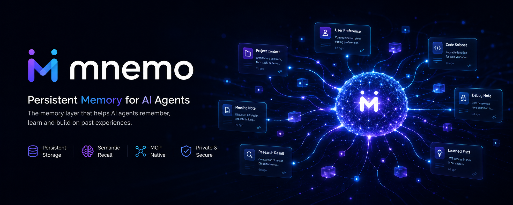

<p align="center">
  
</p>

<p align="center">
  <a href="./README_zh.md">简体中文</a> | <strong>English</strong>
</p>

<p align="center">
  
  
  
</p>

<p align="center">
  
  
  
  
</p>

---

## Why mnemo?

AI coding assistants forget everything between sessions. `CLAUDE.md` stores static rules, but it can't search or reason over accumulated knowledge.

mnemo gives your AI assistant a **searchable, structured memory layer** that persists across sessions:

- **Search by meaning** — FTS5 full-text search + Jaccard reranking + bilingual expansion
- **Session warmup** — MCP Resources auto-inject top facts at session start, zero tool calls
- **Query refinement** — strips action words and noise tokens before memory search
- **Trust scoring** — facts gain or lose trust over time based on feedback and decay
- **Entity graph** — automatic entity extraction with multi-hop relationship queries
- **Contradiction detection** — finds conflicting facts and demotes the older one
- **Auto-dedup** — three-layer deduplication prevents duplicate facts
- **LLM-driven dream** — merge same-topic facts, compress long content, resolve contradictions

## Quick Start

```bash
# Install
npm install -g @morningljn/mnemo

# One-command setup (register MCP + write rules + set permissions)
mnemo-init
```

That's it. Restart your AI assistant and it will have persistent memory.

### Manual Setup

If you prefer manual configuration:

**1. Register MCP server:**

```bash
claude mcp add mnemo -- mnemo
```

**2. Add memory rules to `~/.claude/CLAUDE.md`:**

```markdown
# mnemo Memory System

- Identity questions ("who are you") → fact_store(search, query="角色设定") first, answer per settings
- User says "remember" → fact_store(add), search first to deduplicate
- When a memory was useful → fact_feedback(helpful, fact_id)
- After complex tasks, auto-detect new habits/preferences/decisions/workflows → fact_store(auto_observe, category=...)
```

**3. Allow tools in `~/.claude/settings.json`:**

```json
{
  "permissions": {
    "allow": [
      "mcp__mnemo__fact_store",
      "mcp__mnemo__fact_feedback"
    ]
  }
}
```

### Codex

Add to your Codex MCP configuration:

```json
{
  "mcpServers": {
    "mnemo": {
      "command": "mnemo"
    }
  }
}
```

## Tools

### `fact_store`

The primary tool for reading and writing structured facts. Supports 12 actions:

| Action | Description | Key Parameters |
|--------|-------------|----------------|
| `add` | Add a new fact (auto-dedup; merges if similar; max 300 chars) | `content`, `category`, `tags` |
| `search` | Keyword search with FTS5 + Jaccard reranking | `query`, `category`, `min_trust`, `limit` |
| `probe` | Find all facts about a specific entity | `entity`, `min_trust`, `limit` |
| `related` | Find facts related to an entity through shared context | `entity`, `min_trust`, `limit` |
| `reason` | Multi-entity reasoning: find facts connected to all given entities | `entities`, `min_trust`, `limit` |
| `contradict` | Detect pairs of facts that share entities but conflict in content | `limit` |
| `update` | Update an existing fact's content, tags, category, or trust score | `fact_id`, `content`, `tags`, `category`, `trust_delta` |
| `remove` | Delete a fact by ID | `fact_id` |
| `list` | Browse facts sorted by trust score | `category`, `min_trust`, `limit` |
| `learn` | Run self-learning: promote/demote/age facts based on usage stats | — |
| `audit` | Quality report without modifying data | — |
| `dream` | LLM-driven memory consolidation: merge + compress + resolve contradictions | — |
| `cleanup` | Scan for oversized facts that may need splitting | — |

### `fact_feedback`

Rate a fact after use. Good facts rise, bad facts decay.

| Action | Effect |
|--------|--------|
| `helpful` | +0.05 trust |
| `unhelpful` | -0.10 trust |

## Dream Cycle

mnemo includes an LLM-driven dream cycle that keeps your memory clean and efficient:

```bash
mnemo-dream
```

**Two-phase pipeline:**

1. **Merge** — LLM identifies same-topic facts and merges them into one complete entry. Resolves contradictions by preferring newer information.
2. **Compress** — LLM condenses verbose content while preserving all key facts (URLs, emails, numbers, names, config params).

**Safety features:**
- Auto-backup before any changes (`~/.mnemo/backup/`)
- High-trust facts (score > 0.8) are protected from deletion
- High-frequency facts (retrieved > 100 times) are protected
- Falls back to rule-based engine when LLM is unavailable

**Configuration** (`~/.mnemo/config.json`):

```json
{
  "baseUrl": "https://dashscope.aliyuncs.com/compatible-mode/v1",
  "apiKey": "your-api-key",
  "model": "qwen3.5-122b-a10b"
}
```

## MCP Resources

mnemo exposes 5 global category resources for **zero-cost session warmup**:

| Resource URI | Description |
|-------------|-------------|
| `mnemo://global/identity` | Identity facts (top 10 by trust) |
| `mnemo://global/coding_style` | Coding style preferences |
| `mnemo://global/tool_pref` | Tool preferences |
| `mnemo://global/workflow` | Workflow preferences |
| `mnemo://global/general` | General facts |

MCP clients (Claude Code, Codex) automatically fetch these resources at session start, injecting memory into system context without any tool calls.

## Architecture

```
┌───────────────────┐   stdio    ┌────────────┐   SQLite    ┌─────────────────────┐
│   MCP Client      │◄─────────►│  mnemo     │◄───────────►│ ~/.mnemo/facts.db   │
│ (Claude / Codex)  │   JSON    │  server    │             │                     │
│                   │           └─────┬──────┘             │ Tables:             │
│  Auto-fetch:      │                 │                    │   facts             │
│  mnemo://global/* │      ┌──────────┼──────────┐         │   entities          │
│  (session warmup) │      │          │          │         │   fact_entities     │
└───────────────────┘      │          │          │         │   retrieval_log     │
                           │          │          │         │ Indexes:            │
                     Resources   Retriever   Dream        │   facts_fts (FTS5)  │
                     (warmup,   (search,    Engine        │   idx_facts_trust   │
                      cache)     probe,     (merge,       │   idx_facts_category│
                                 reason,    compress)     └─────────────────────┘
                                 refine)
```

## Categories

| Category | Description | Decay Rate |
|----------|-------------|------------|
| `identity` | User identity: name, role, preferences | 0.02/week |
| `coding_style` | Coding conventions, naming, formatting | 0.03/week |
| `tool_pref` | Tool and framework preferences | 0.03/week |
| `workflow` | Development workflow, CI/CD, git practices | 0.02/week |
| `general` | General knowledge and other facts | 0.03/week |

## Development

```bash
npm install
npm test        # run tests with vitest
npm run build   # compile TypeScript
npm start       # start MCP server
```

## License

[MIT](./LICENSE)
