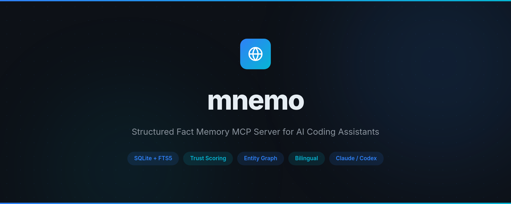

<p align="center">
  
</p>

<p align="center">
  <strong>简体中文</strong> | <a href="./README.md">English</a>
</p>

---

## 为什么需要 mnemo？

AI 编程助手在会话结束后会忘记所有内容。`CLAUDE.md` 只能存储静态规则，无法搜索或推理积累的知识。

mnemo 为你的 AI 助手提供**可搜索、结构化的记忆层**，跨会话持久化：

- **语义搜索** — FTS5 全文检索 + Jaccard 重排序 + 中英双语扩展
- **会话预热** — MCP Resources 在会话启动时自动注入高频记忆，零工具调用
- **查询提炼** — 搜索前自动剥离动作词和噪声词
- **信任评分** — 事实随时间根据反馈和衰减获得或失去信任
- **实体图谱** — 自动实体抽取，支持多跳关联查询
- **矛盾检测** — 发现冲突事实并降级较旧的那条
- **自动去重** — 三层去重机制（实体重叠、Jaccard 相似度、包含检测）
- **LLM 驱动的 Dream** — 合并同主题、精简冗长内容、解决矛盾

## 快速开始

```bash
# 安装
npm install -g @morningljn/mnemo

# 一键配置（注册 MCP + 写入规则 + 设置权限）
mnemo-init
```

重启你的 AI 助手即可拥有持久记忆。

### 手动配置

如果你更喜欢手动配置：

**1. 注册 MCP 服务器：**

```bash
claude mcp add mnemo -- mnemo
```

**2. 在 `~/.claude/CLAUDE.md` 中添加记忆规则：**

```markdown
# 记忆系统

你有 mnemo 记忆工具（fact_store / fact_feedback）。规则：

## 规则 1：会话预热（自动）
mnemo MCP Resources 在会话启动时自动注入全局记忆到 system context。
你不需要主动调用 fact_store(search) 来获取高频记忆。

## 规则 2：按需查询
仅在以下情况调用 fact_store(action="search")：
- 用户消息涉及个人偏好/习惯/工具选择且预热中未覆盖
- 用户明确查询记忆（"我之前说过什么""按我的习惯"）
- 技术选型时需要确认用户偏好

不触发查询的情况：
- 纯操作指令（"运行测试""git commit"）
- 通用技术问题（"Promise 怎么用"）
- 代码审查/解释请求

## 规则 3：按需写入
用户说"记住"时，调用 fact_store(action="add", content="...", category="...")。
先搜索避免重复。类别：identity / coding_style / tool_pref / workflow / general。

## 规则 4：反馈强化
记忆有用时，调用 fact_feedback(action="helpful", fact_id=...)。
```

**3. 在 `~/.claude/settings.json` 中允许工具：**

```json
{
  "permissions": {
    "allow": [
      "mcp__mnemo__fact_store",
      "mcp__mnemo__fact_feedback"
    ]
  }
}
```

### Codex

添加到你的 Codex MCP 配置：

```json
{
  "mcpServers": {
    "mnemo": {
      "command": "mnemo"
    }
  }
}
```

## 工具

### `fact_store`

读写结构化事实的主工具，支持 12 种操作：

| 操作 | 说明 | 关键参数 |
|------|------|----------|
| `add` | 添加事实（自动去重，相似则合并，单条 ≤300 字） | `content`、`category`、`tags` |
| `search` | 关键词搜索（FTS5 + Jaccard 重排序） | `query`、`category`、`min_trust`、`limit` |
| `probe` | 查找某实体的所有事实 | `entity`、`min_trust`、`limit` |
| `related` | 通过共享上下文查找关联事实 | `entity`、`min_trust`、`limit` |
| `reason` | 多实体推理：查找与所有给定实体相关的事实 | `entities`、`min_trust`、`limit` |
| `contradict` | 检测共享实体但内容冲突的事实对 | `limit` |
| `update` | 更新事实的内容、标签、类别或信任分 | `fact_id`、`content`、`tags`、`category`、`trust_delta` |
| `remove` | 按 ID 删除事实 | `fact_id` |
| `list` | 按信任分浏览事实 | `category`、`min_trust`、`limit` |
| `learn` | 自学习：根据使用统计提升/降级/老化事实 | — |
| `audit` | 质量报告，不修改数据 | — |
| `dream` | LLM 驱动的记忆整理：合并 + 精简 + 解决矛盾 | — |
| `cleanup` | 扫描超长 fact，报告需要拆分的条目 | — |

### `fact_feedback`

使用事实后评分。好事实上升，坏事实下降。

| 操作 | 效果 |
|------|------|
| `helpful` | +0.05 信任 |
| `unhelpful` | -0.10 信任 |

## Dream 整理周期

mnemo 内置 LLM 驱动的 dream 周期，保持记忆库整洁高效：

```bash
mnemo-dream
```

**两阶段管线：**

1. **合并** — LLM 识别同主题事实并合并为一条完整条目。检测矛盾并以较新信息为准。
2. **精简** — LLM 压缩冗长内容，保留所有关键信息（URL、邮箱、数字、人名、配置参数）。

**安全保护：**
- 执行前自动备份（`~/.mnemo/backup/`）
- 高信任分事实（> 0.8）受保护不被删除
- 高频检索事实（> 100 次）受保护
- LLM 不可用时自动降级到规则引擎

**配置**（`~/.mnemo/config.json`）：

```json
{
  "baseUrl": "https://dashscope.aliyuncs.com/compatible-mode/v1",
  "apiKey": "your-api-key",
  "model": "qwen3.5-122b-a10b"
}
```

## MCP Resources

mnemo 提供 5 个全局类别资源，用于**零成本的会话预热**：

| 资源 URI | 说明 |
|----------|------|
| `mnemo://global/identity` | 身份事实（信任分前 10） |
| `mnemo://global/coding_style` | 编码风格偏好 |
| `mnemo://global/tool_pref` | 工具偏好 |
| `mnemo://global/workflow` | 工作流偏好 |
| `mnemo://global/general` | 通用事实 |

MCP 客户端（Claude Code、Codex）在会话启动时自动获取这些资源，无需任何工具调用即可注入记忆。

## 类别

| 类别 | 说明 | 衰减率 |
|------|------|--------|
| `identity` | 用户身份：姓名、角色、偏好 | 0.02/周 |
| `coding_style` | 编码规范、命名、格式化 | 0.03/周 |
| `tool_pref` | 工具和框架偏好 | 0.03/周 |
| `workflow` | 开发工作流、CI/CD、Git 实践 | 0.02/周 |
| `general` | 通用知识和其他事实 | 0.03/周 |

## 开发

```bash
npm install
npm test        # 运行测试（vitest）
npm run build   # 编译 TypeScript
npm start       # 启动 MCP 服务器
```

## 许可证

[MIT](./LICENSE)
